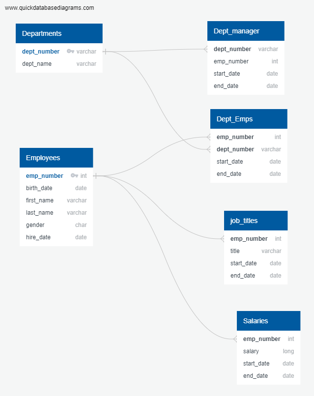
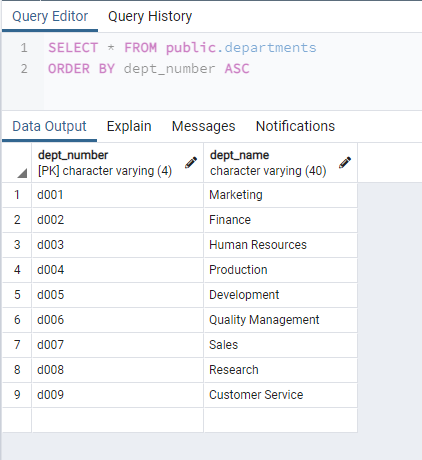
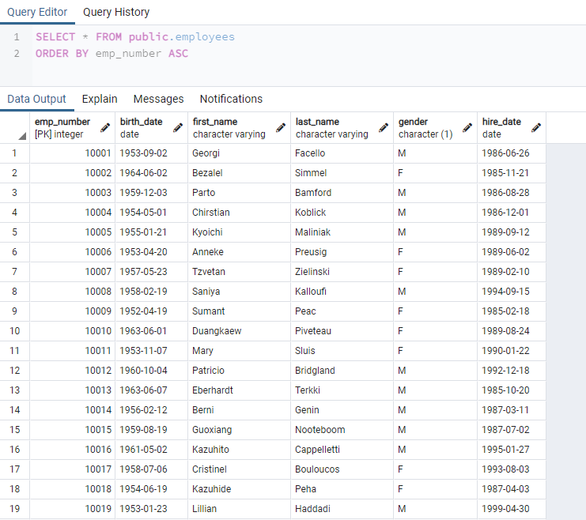
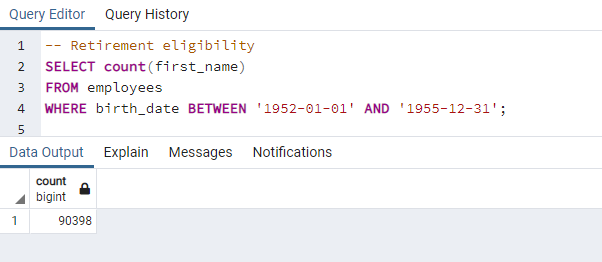
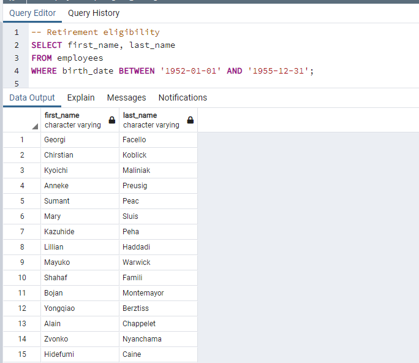
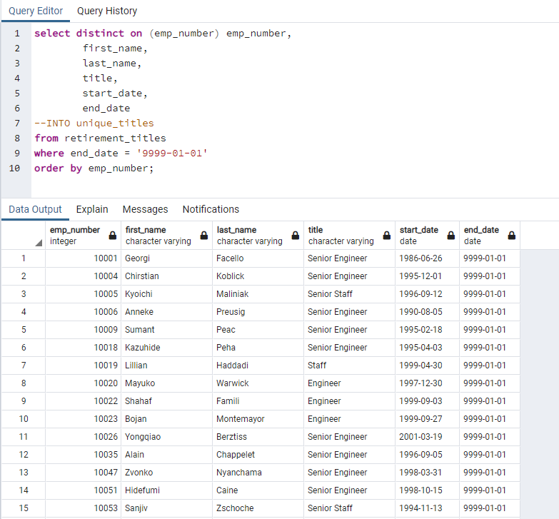
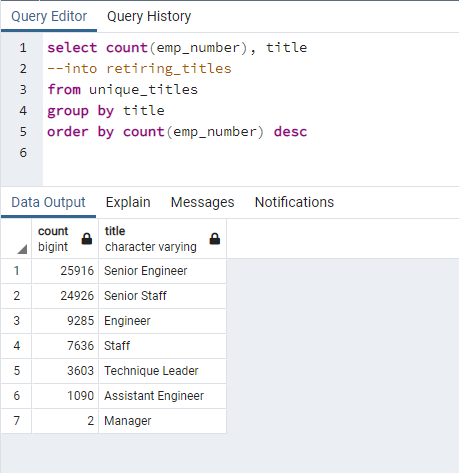
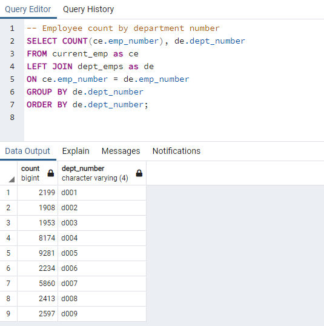
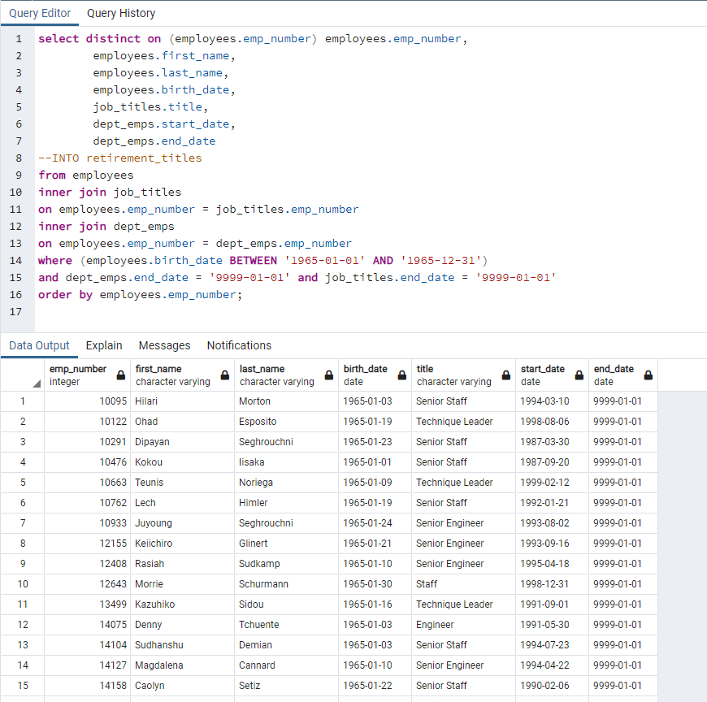
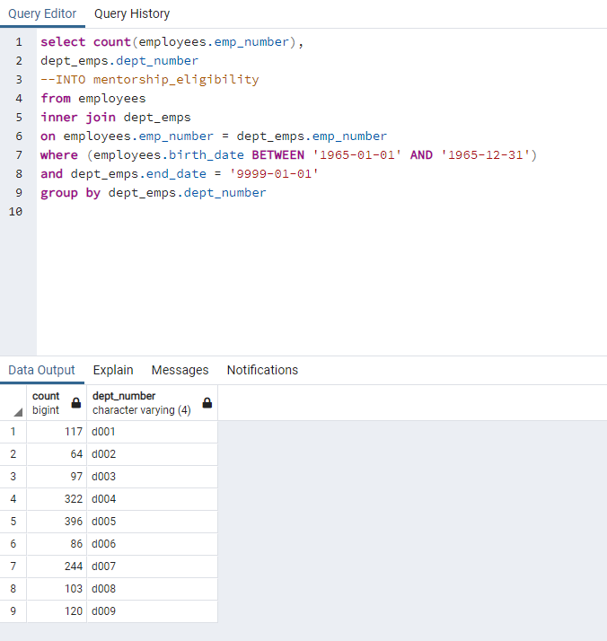

# Pewlett-Hackard-Analysis
A large company, Pewlett Hackard, is facing a large number of retirements in the near future. Their management has asked us to help analyze employee data to find out who is coming up on retirement age, and help answer the following questions:

- Who will be of retirement age
- How many people will possibly be retiring

## Overview of Data

to start this project we were provided data files dealing with employees and departments in the company. As we looked at the data we found we had
 - employee personal data
 - Job titles
 - Salaries
 - what departments an employees is currently assigned to
 - department data
 - who currently manages the department
 
After reviewing some of the data, we decided we need to bring to structure to the data to aid in our analysis. We decided to model the data into a database schema which looks like:

 
## Review of data loads

After building the database we loaded the provided data into the appropriate tables we make sure to confirm the data loads were successful. We looked at the Departments table after the data load and we saw the following: 

We looked at the Employees table after the data load and we saw the following:

 

## Analysis of data

The first step of analysis of the problem was to determine the size of the problem, how many employees are eligible for retirement.

We looked into the employee data for anyone born between the dates of 01-01-1952 and 12-31-1955. we then counted all of the employees in this group and found Pewlett Hackard has over 90,000 employees eligible for retirement. This number includes both current employees and already retired employees.

Once we determined how many employees we were dealing with, we had a number of questions:

- Who were the employees eligible for retirement?
- What type of skills will be lost to retirement?
- What departments would be affected?
- Do we have some younger employees who we can mentor to replace the retiring employees?

### Employees eligible for Retirement

The first major question we needed to answer for management was to identify all of the employees. The analysis of the data for this question was straight forward. We needed to search the employee data for employees that had birth dates in a certain range.

### Employees Skills Being Lost to Retirement

Now that the list of eligible employees had been produced. The next major question we needed to answer for management was what kind of skill loss would Pewlett Hackard suffer from all of the retirements. So we joined the list of eligible employees with a list of job titles. This gave us a list of all the eligible employees that looked like this:  

After identifying the current employees of the company, we count all of the entries grouped by job title, and get the following list:

Obviously most of our losses are in our senior staff and leadership, 75.14% of current staff eligible, with Engineers making up 50% of the employees.

### Departments Being Affected by Retirement

The next major question we needed to answer for management was what departments of Pewlett Hackard will be affected and how badly will they be affected by all of the retirements. We joined the list of employees to the list of current employees assigned a department. We count employees eligible for each department and get the following:

### Employees eligible for Mentorship

The last major question we needed to answer for management was does Pewlett hackard have any up and coming employees which can be mentored to help replace the skills loss from the retirement. We go back to the employees data we were provided and look for a new group of employees, those born in 1965. With just this one year we found that Pewlett Hackard had over 1,500 employees eligible for mentoring.

We took the list of mentoring eligible employees and then counted them by department and found we had a very nice spread of employees across all department with production and development having the most eligible employees.

## Summary

While the next few years may see a large exodus of employees who are eligible for retirement, we do have a strong contingent of up and coming employees who can be mentored to take over the leadership positions being vacated by retirements.

